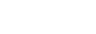
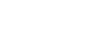
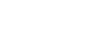
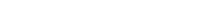
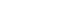
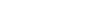
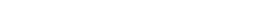

# Boid Simulation

This is an extended implementation of Reynolds' Boids algorithm in C using SDL.<br>
Boid's flocking behaviour is simulated using a simple rule-based system :
- **Cohesion :** Boids try to stay close to local flockmates.<br>


- **Separation :** Boids try to avoid crowding local flockmates.<br>


- **Alignment :** Boids try to fly the same direction as local flockmates.<br>


Where :
- **V** is the set of boids in the neighbourhood of a boid.
- **N** is the number of boids in the neighbourhood of a boid.
- **p**, **v** and **a** are the position, velocity and acceleration vectors of a boid.

We can then apply coefficients to each rule to tune the flocking behaviour :<br>


Each frame, the boids are updated using the following formula :<br>


# Additional features

Boid velocity is capped to a maximum value :<br>


If a boid is going towards a wall, it will be repelled by it :
```
limit_pos(boid, width, height, limit) {
    if (boid.pos.x < limit && boid.acc.x < 0 || boid.pos.x > width-limit && boid.acc.x > 0)
        boid1.acc.x *= -1;

    if (boid.pos.y < limit && boid.acc.y < 0 || boid1.pos.y > height-limit && boid.acc.y > 0)
        boid1.acc.y *= -1;
}
```

Some boids are designated as leaders and other boids will follow them :<br>


Where :
- **L** is the strenght of the leader's influence.
- **p<sub>L</sub>** is the position of the leader.
- **p** is the position of another boid.

The acceleration of a boid then follows this formula :<br>
